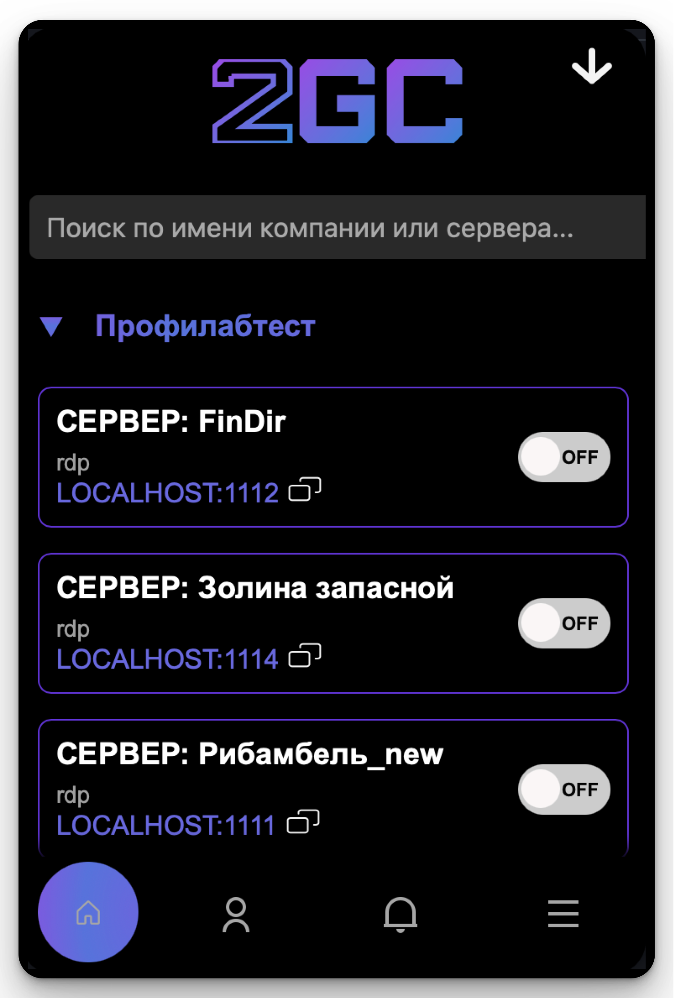

# Десктоп-приложение 2GC для macOS

**2GC Desktop App** — это удобное и безопасное приложение для подключения к удалённым серверам вашей компании. Оно обеспечивает быстрый доступ к туннелям RDP/SSH и позволяет управлять состоянием подключения в один клик.

\
\

***

#### Интерфейс

На главном экране отображаются:

* **Поиск** по имени сервера или компании
* Список компаний и серверов, к которым у вас есть доступ
* Название сервера, тип соединения (например, `rdp`)
* Локальный адрес подключения (`localhost:порт`) с возможностью копирования
* Переключатель подключения (включение/выключение туннеля)

***

#### Основные функции

* **Запуск туннеля**: нажмите `ON` — приложение автоматически поднимает туннель и активирует локальную переадресацию порта.
* **Остановка туннеля**: нажмите `OFF` — туннель будет остановлен, соединение закрыто.
* **Копирование адреса**: кликните по значку копирования рядом с `localhost:порт`, чтобы вставить в RDP-клиент или терминал.
* **Автоматическая авторизация**: используется сохранённый `refresh_token` для восстановления доступа без ручного входа.

***

#### Безопасность

* Поддержка **Zero Trust-модели**: вы видите только те серверы, к которым получили доступ
* Все туннели шифруются с использованием Cloudflare Argo
* Доступ ограничивается текущей ролью пользователя и группой
