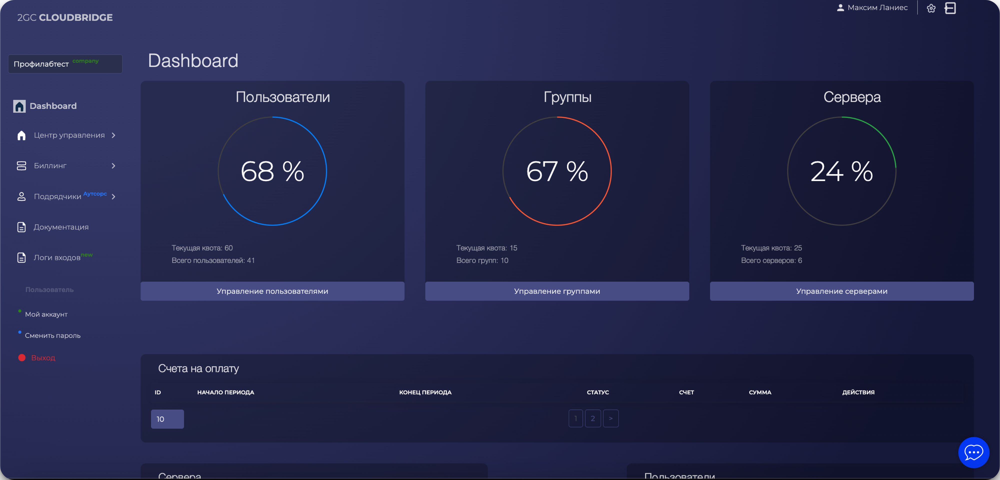

---
layout:
  title:
    visible: true
  description:
    visible: false
  tableOfContents:
    visible: true
  outline:
    visible: true
  pagination:
    visible: true
---

# Dashboard (панель управления)

<figure><figcaption></figcaption></figure>

**Dashboard** — это основная обзорная панель в Личном кабинете 2GC, предоставляющая краткую сводку по ключевым параметрам вашей учётной записи и инфраструктуры.

**Основные метрики**

В верхней части отображаются три виджета с круговыми диаграммами:

* **Пользователи** — показывает текущую квоту и количество добавленных пользователей.\
  ⤷ Кнопка **"Управление пользователями"** ведёт к разделу управления сотрудниками.
* **Группы** — информация о количестве групп доступа.\
  ⤷ Кнопка **"Управление группами"** открывает соответствующий интерфейс.
* **Сервера** — прогресс использования лимита по количеству серверов.\
  ⤷ Кнопка **"Управление серверами"** открывает страницу со списком серверов.

**Блок "Счета на оплату"**

Отображает список сформированных счетов за услуги. В таблице выводится:

* ID счёта
* Даты начала и конца периода
* Статус (оплачен, просрочен и т.д.)
* Сумма и доступные действия (например, скачать PDF или оплатить)

**Блок "Сервера"**

Таблица с информацией по всем серверам:

* ID сервера
* Наименование
* Дата создания
* Текущий статус (active, suspended и т.д.)

**Блок "Пользователи"**

Список пользователей компании:

* ID пользователя
* Имя/почта
* Дата регистрации
* Статус (активный, заблокирован и т.д.)
