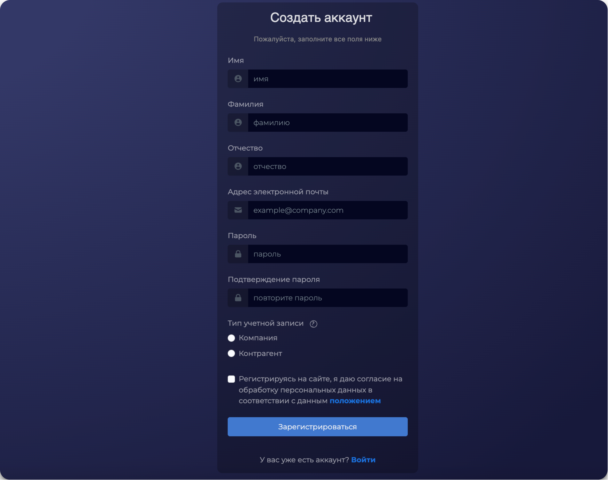

# Основной аккаунт

Процесс регистрации пользователя в 2GC состоит из следующих шагов:

1. **Переход на страницу регистрации:**
   * Пользователь переходит по ссылке [https://lk.2gc.ru/accounts/register/](https://lk.2gc.ru/accounts/register/) или нажимает на кнопку "Создать аккаунт» на странице входа".
2. **Заполнение регистрационной формы:**
   * Имя, фамилию и отчество (не обязательно).
   * Указывается адрес электронной почты.
   * Задаётся пароль и подтверждение пароля.&#x20;
   * Выбирается тип аккаунта компания или контрагент.
3. **Подтверждение email:**
   * На указанный email отправляется ссылка для подтверждения.
   * Перейдите по ссылке и активируйте аккаунт.
4.  **Завершение регистрации:**

    * После активации вы сможете войти в систему и получить доступ к личному кабинету.

    <figure><figcaption></figcaption></figure>

